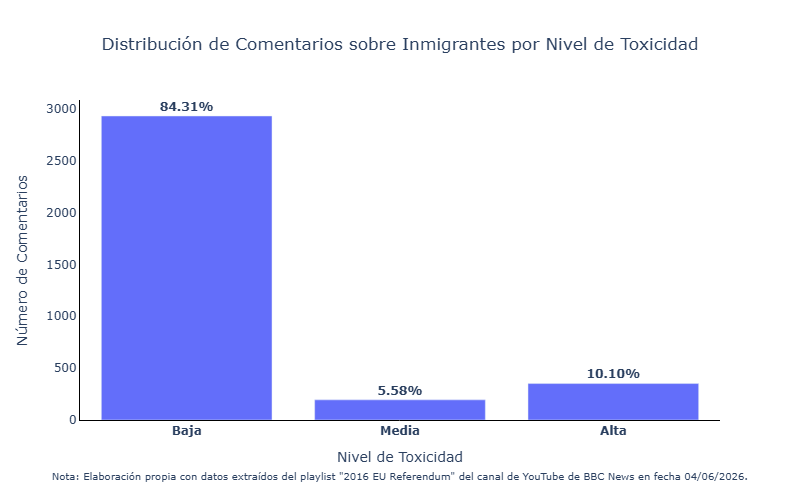
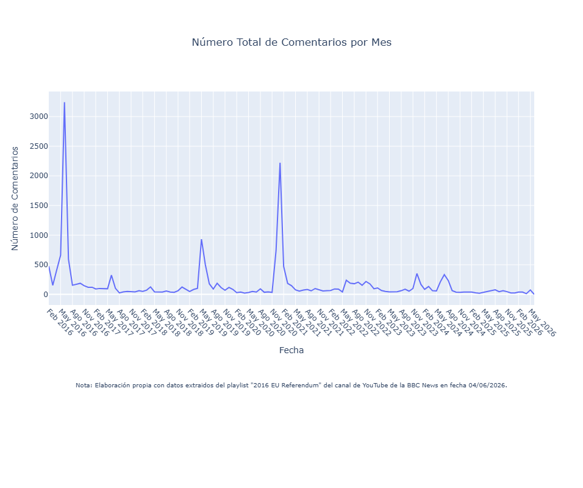

# Results

This folder contains the main visual outputs generated during the analysis of immigration-related discourse in YouTube comments published during the Brexit referendum campaign.

The figures summarize the prevalence of toxic language and the temporal dynamics of comment activity within the dataset.

## Included Visualizations

### 1. Immigration Comments by Level of Toxicity

File:

This figure shows the distribution of immigration-related comments according to three toxicity levels (low, medium, and high) based on Detoxify scores.

Main finding:

- Most comments exhibited low toxicity.
- Approximately 10% of comments were classified as highly toxic.
- A smaller proportion fell within the medium toxicity range.

---

### 2. YouTube Comments Over Time

File:

This figure displays the monthly evolution of comment activity associated with videos from the BBC News playlist "2016 EU Referendum".

Main finding:

- Comment activity peaked around key Brexit-related political events.
- Several periods of heightened public engagement can be observed throughout the referendum campaign and its aftermath.

